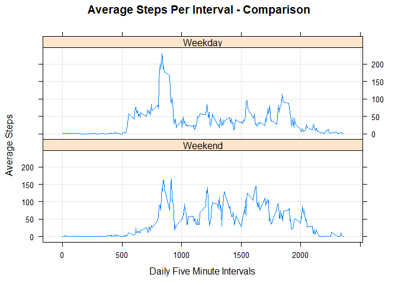

## Preparing the Environment
Load the Lubridate library which will be used to convert a string representation of the date to the Date type.  Also load the Lattice library to create a panel plot.


```r
library(lubridate)
```

```
## Warning: package 'lubridate' was built under R version 3.4.4
```

```r
library(lattice)
```


Initialize some variables.  This code assumes the 

```r
dataDir <- "."
dataZip <- file.path(dataDir, "activity.zip")
dataCSV <- file.path(dataDir, "activity.csv")
```


## Loading and Processing the Data
Unzip the activity.zip data file located in the working directory.

```r
unzip(dataZip)
```


Read the activity.csv file that was included in activity.zip into a data frame.

```r
activity <- read.csv(file=dataCSV, stringsAsFactors = FALSE)
```


Take a quick peek at the data to see that it loaded properly and what it looks like.

```r
str(activity)
```

```
## 'data.frame':	17568 obs. of  3 variables:
##  $ steps   : int  NA NA NA NA NA NA NA NA NA NA ...
##  $ date    : chr  "2012-10-01" "2012-10-01" "2012-10-01" "2012-10-01" ...
##  $ interval: int  0 5 10 15 20 25 30 35 40 45 ...
```


Use Lubridate to convert the 'date' column from a string to a proper date.

```r
activity$date <- ymd(activity$date)
str(activity)
```

```
## 'data.frame':	17568 obs. of  3 variables:
##  $ steps   : int  NA NA NA NA NA NA NA NA NA NA ...
##  $ date    : Date, format: "2012-10-01" "2012-10-01" ...
##  $ interval: int  0 5 10 15 20 25 30 35 40 45 ...
```

### Analysis
#### What is the Mean Total Number of Steps per Day?

First calculate the total number of steps per day using the aggregate function.

```r
stepsPerDay <- aggregate(steps ~ date, activity, FUN=sum)
str(stepsPerDay)
```

```
## 'data.frame':	53 obs. of  2 variables:
##  $ date : Date, format: "2012-10-02" "2012-10-03" ...
##  $ steps: int  126 11352 12116 13294 15420 11015 12811 9900 10304 17382 ...
```


Explore the data a bit using a Histogram.

```r
hist(x=stepsPerDay$steps, xlab="Steps/Day", main="Histogram of Steps")
```

<!-- -->


The mean and median of the total number of steps/day.

```r
mean(stepsPerDay$steps)
```

```
## [1] 10766.19
```

```r
median(stepsPerDay$steps)
```

```
## [1] 10765
```


#### What is the Average Daily Pattern?
Explore the average number of steps per interval.  That is, using the full range of dates, determine the average step activity per interval across the data set.

```r
meanStepsPerInterval <- aggregate(steps ~ interval, activity, FUN=mean)
plot(x=meanStepsPerInterval$interval,
     y=meanStepsPerInterval$steps,
     type="l",
     main="Average Steps Per Interval",
     xlab="Daily Five Minute Interval",
     ylab="Average Steps")
```

<!-- -->


Which five minute interval has the highest average number of steps?

```r
meanStepsPerInterval[which.max(meanStepsPerInterval$steps),]
```

```
##     interval    steps
## 104      835 206.1698
```


#### Imputing Missing Values
Consider how many missing values there are and determine a way to impute the missing data.

Determine the number of missing values.

```r
sum(is.na(activity$steps))
```

```
## [1] 2304
```

A reasonable way to fill in these missing steps values is to use the mean steps per interval as calculated across the full data set.

First a function that returns the mean steps per interval for the given interval.

```r
GetMeanStepsByInterval <- function(interval) {
    # Given the interval, returns mean steps for that interval
    #
    # Args:
    #  interval: the interval number
    #
    # Returns:
    #   The mean number of steps for the specified interval as found in
    #   the precalculated stepsPerInterval data frame
    return(meanStepsPerInterval[meanStepsPerInterval$interval == interval, ]$steps)
}
```
And a function to take the data set and return a new data frame with the missing steps values filled in using the mean steps per interval.

```r
ImputeActivitySteps <- function(a) {
    # Imputes missing occurances of the steps value in the provided data frame
    # using the mean value of steps for the associated interval calculated
    # across the entire data set
    #
    # Args:
    #  a: the data frame to fill
    #
    # Returns:
    #   A data frame with the missing steps values filled using the average
    #   step value for that interval as calculated from the full data set
    activityImp <- a
    for (i in 1:nrow(activityImp)) {
        if (is.na(activityImp[i, ]$steps)) {
          activityImp[i,]$steps <- GetMeanStepsByInterval(activityImp[i,]$interval)
        }
    }
    return(activityImp)
}
```

Now call the function to fill in the missing values.

```r
activityImp <- ImputeActivitySteps(activity)
```

There should be no missing values in this new data frame.

```r
sum(is.na(activityImp$steps))
```

```
## [1] 0
```

Exploring the new data frame further.
Again calculate the total number of steps per day using the aggregate function.

```r
stepsPerDayImp <- aggregate(steps ~ date, activityImp, FUN=sum)
str(stepsPerDayImp)
```

```
## 'data.frame':	61 obs. of  2 variables:
##  $ date : Date, format: "2012-10-01" "2012-10-02" ...
##  $ steps: num  10766 126 11352 12116 13294 ...
```


Explore the data a bit using a Histogram.

```r
hist(x=stepsPerDayImp$steps, xlab="Steps/Day", main="Histogram of Steps")
```

<!-- -->


The mean and median of the total number of steps/day after imputing missing step values.

```r
mean(stepsPerDayImp$steps)
```

```
## [1] 10766.19
```

```r
median(stepsPerDayImp$steps)
```

```
## [1] 10766.19
```
The mean value is the same as before imputing the missing values which is expected since missing values were filled using the mean value from across the full data set for each corresponding interval.

The median value of the imputed data happens to be equal to the mean value.

Comparing the first histogram using the data set with missing values to the second histogram created using the imputed data set there is an expected increase in total daily number of steps since the method of imputing the missing values involved adding steps to where the values were previously empty.

#### Are There Differences in Activity Patterns Between Weekdays and Weekends?
Using the date of each record, first determine whether the date is a weekday or a weekend and assign the values to the data frame.

```r
weekend <- c('Sat','Sun')
activityImp$dayType <- factor((weekdays(activityImp$date, abbreviate=TRUE) %in% weekend),
                              levels=c(TRUE, FALSE), labels=c('Weekend','Weekday'))  
```

Quick validation that the results are reasonable.

```r
table(activityImp$dayType)
```

```
## 
## Weekend Weekday 
##    4608   12960
```

And a panel plot to compare the activity patterns between weekdays and weekends.

```r
meanStepsPerIntervalDay <- aggregate(steps ~ interval + dayType, data=activityImp, FUN=mean)
xyplot(steps ~ interval | dayType, data=meanStepsPerIntervalDay,
                                   grid=TRUE,
                                   layout=c(1,2),
                                   type="l",
                                   ylab="Average Steps",
                                   xlab="Daily Five Minute Intervals",
                                   main="Average Steps Per Interval - Comparison")
```

<!-- -->
